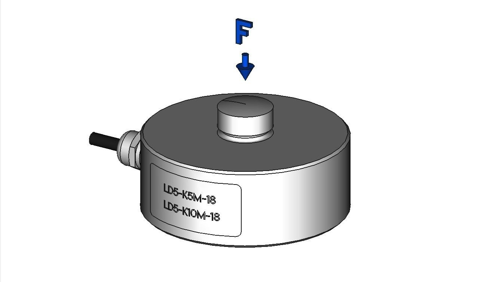

<link rel="stylesheet" href="./style.css">

  <button class="btn btn-print" onclick="window.print()">🖨️ STAMPA PDF</button>
  <a href="./index.html" class="btn btn-nav">🏠 MENU</a>

# 1. Teoria e Classificazione

  <strong>OBIETTIVO:</strong> Comprendere il funzionamento della catena di misura e distinguere le categorie di sensori secondo la normativa tecnica.

  <h2>1. LA CATENA DI MISURA</h2>
  
Un sistema di misura è un insieme di elementi che trasformano una grandezza fisica in un segnale interpretabile (numerico o analogico).

  
  
Lo schema a blocchi universale è:

  
  
FIG. 1 - Struttura di una Catena di Acquisizione Dati

  <h2>2. SENSORI PRIMARI E SECONDARI</h2>
  
Questa classificazione dipende dal numero di conversioni energetiche interne al sensore.

  <table>
    <tr>
      <th>TIPO</th>
      <th>DESCRIZIONE</th>
      <th>ESEMPIO</th>
    </tr>
    <tr>
      <td><strong>PRIMARI</strong></td>
      <td>La grandezza fisica agisce direttamente sull'elemento sensibile (unica conversione).</td>
      <td><strong>Termocoppia</strong>: Calore &rarr; Tensione Elettrica.</td>
    </tr>
    <tr>
      <td><strong>SECONDARI</strong></td>
      <td>La misura avviene tramite stadi intermedi (es. meccanici prima che elettrici).</td>
      <td><strong>Cella di Carico</strong>: Forza &rarr; Deformazione &rarr; Resistenza.</td>
    </tr>
  </table>

  <h2>3. SENSORI ATTIVI E PASSIVI</h2>
  
Indica se il componente necessita di una fonte di energia esterna per operare.

  <h3>⚡ SENSORI ATTIVI (Generatori)</h3>
  <ul>
    <li>Sono autonomi: generano energia elettrica prelevandola direttamente dalla grandezza fisica.</li>
    <li><em>Esempi: Piezoelettrici, Dinamo Tachimetriche, Termocoppie.</em></li>
  </ul>

  

  <h3>🔋 SENSORI PASSIVI (Modulatori)</h3>
  <ul>
    <li>Richiedono alimentazione esterna per funzionare (eccitazione).</li>
    <li>Il sensore modifica un parametro elettrico (Resistenza, Capacità, Induttanza).</li>
    <li><em>Esempi: Potenziometri, Termistori (PTC/NTC), Estensimetri.</em></li>
  </ul>

  
  
FIG. 2 - Cella di Carico (Trasduttore Passivo e Secondario)

  <h2>4. METODI PER DEFLESSIONE E AZZERAMENTO</h2>
  
  
<strong>Metodo per Deflessione:</strong> Il valore è indicato dallo spostamento di un indice su una scala (o un valore digitale diretto). È rapido ma meno preciso.

  
  
<strong>Metodo per Azzeramento:</strong> Si confronta la misura con un campione noto finché la differenza è nulla. È lentissimo ma estremamente preciso (es. Bilancia a due piatti o Ponte di Wheatstone).

 

  <a href="./index.html" class="btn btn-nav">⬅ TORNA AL MENU PRINCIPALE</a>

 
