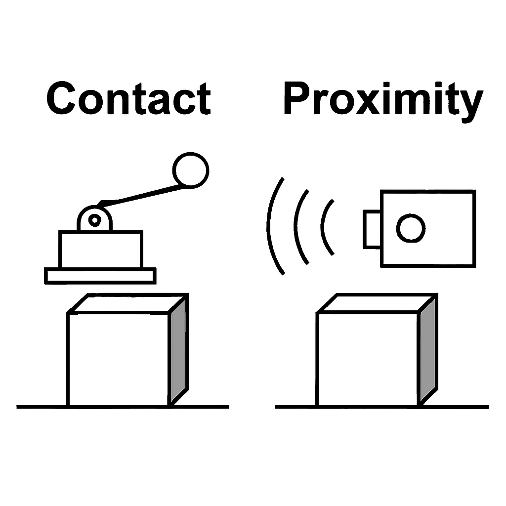

<link rel="stylesheet" href="./style.css">

  <button class="btn btn-print" onclick="window.print()">🖨️ STAMPA PDF</button>
  <a href="./index.html" class="btn btn-nav">🏠 MENU</a>

# 1. Teoria e Classificazione dei Sensori

  <h2>1. SENSORE vs TRASDUTTORE</h2>
  <ul>
    <li><strong>Sensore:</strong> Elemento primario che interagisce con la grandezza (es. la membrana di un microfono).</li>
    <li><strong>Trasduttore:</strong> Dispositivo completo che converte l'energia della grandezza misurata in un segnale elettrico.</li>
  </ul>

  <h2>2. TRASDUTTORI PRIMARI E SECONDARI</h2>
  
<strong>I) TRASDUTTORI PRIMARI:</strong> Convertono direttamente la grandezza fisica in ingresso in una grandezza elettrica. 
  <em>Esempio: Una <strong>termocoppia</strong> trasforma il calore direttamente in tensione elettrica.</em>

  
<strong>II) TRASDUTTORI SECONDARI:</strong> Trasformano preventivamente la grandezza fisica in un'altra grandezza fisica, rilevabile poi attraverso un trasduttore primario.

  
  
  
FIG. 1 - La Cella di Carico: Forza -> Deformazione Meccanica -> Segnale Elettrico

  <h2>3. CARATTERISTICHE STATICHE (Parametri)</h2>
  <ul>
    <li><strong>Campo di misura (Portata):</strong> Intervallo tra valore minimo e massimo misurabile.</li>
    <li><strong>Sensibilità:</strong> Rapporto tra variazione dell'uscita e variazione dell'ingresso ($K = \Delta U / \Delta I$).</li>
    <li><strong>Risoluzione:</strong> La minima variazione della grandezza che il sensore riesce a rilevare.</li>
    <li><strong>Precisione:</strong> Capacità di fornire un valore vicino a quello vero.</li>
  </ul>

  <h2>4. MODALITÀ DI CONTATTO</h2>
  
<strong>A CONTATTO:</strong> Richiedono un legame fisico con l'oggetto (es. termistori, estensimetri, finecorsa meccanici).

  
<strong>SENZA CONTATTO (PROSSIMITÀ):</strong> Rilevano la grandezza a distanza tramite campi magnetici, onde o luce.

  
  
  
FIG. 2 - Confronto tra rilevamento per contatto e sensori di prossimità

  <h2>5. CLASSIFICAZIONE PER SEGNALE</h2>
  <table>
    <tr>
      <th>TIPO</th>
      <th>DESCRIZIONE</th>
      <th>ESEMPIO</th>
    </tr>
    <tr>
      <td><strong>ANALOGICI</strong></td>
      <td>Segnale di uscita continuo che segue le variazioni dell'ingresso.</td>
      <td>Potenziometro, LM35.</td>
    </tr>
    <tr>
      <td><strong>DIGITALI</strong></td>
      <td>Forniscono il valore tramite un codice binario a n bit o impulsi.</td>
      <td>Encoder, Sensore Hall.</td>
    </tr>
  </table>
  
  
  
FIG. 3 - Differenza tra segnale continuo e segnale discreto (binario)

  <h2>6. ALIMENTAZIONE</h2>
  <h3 style="color:#27ae60">⚡ ATTIVI (Generatori)</h3>
  
Generano energia elettrica direttamente dalla grandezza fisica. Non richiedono alimentazione esterna (es. Termocoppie, Piezoelettrici).

  <h3 style="color:#c0392b">🔋 PASSIVI (Modulatori)</h3>
  
Richiedono alimentazione esterna per funzionare; il sensore varia una sua proprietà (es. Resistenza in NTC o Potenziometri).

 

  <a href="./index.html" class="btn btn-nav">⬅ TORNA AL MENU PRINCIPALE</a>

 
