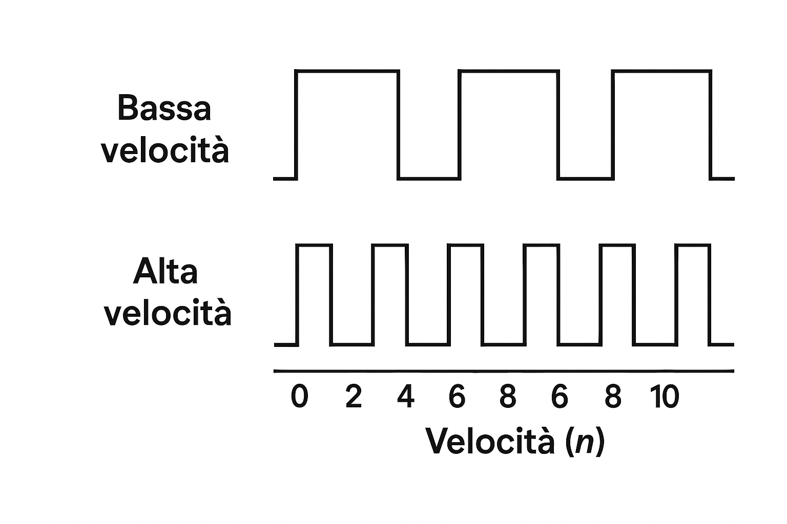

# 2. Sensori di Posizione

I sensori di posizione rilevano lo spostamento lineare o angolare di un oggetto.

## Encoder
L'encoder è uno dei sensori più utilizzati per la posizione angolare. Qui sotto vediamo i segnali a impulsi (canale A e B) generati durante la rotazione:

[Torna all'Indice](./index.md)
