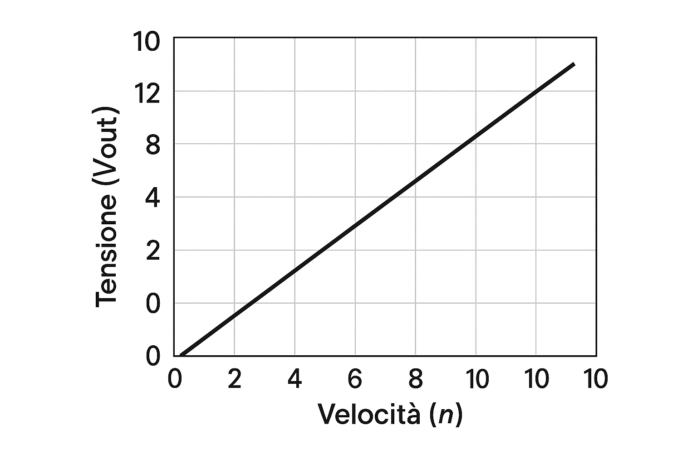

# 3. Sensori di Velocità

Servono a misurare la velocità angolare (RPM) o lineare.

## Dinamo Tachimetrica
È un generatore che fornisce una tensione proporzionale alla velocità. Ecco il grafico della sua caratteristica (V/n):

[Torna all'Indice](./index.md)
