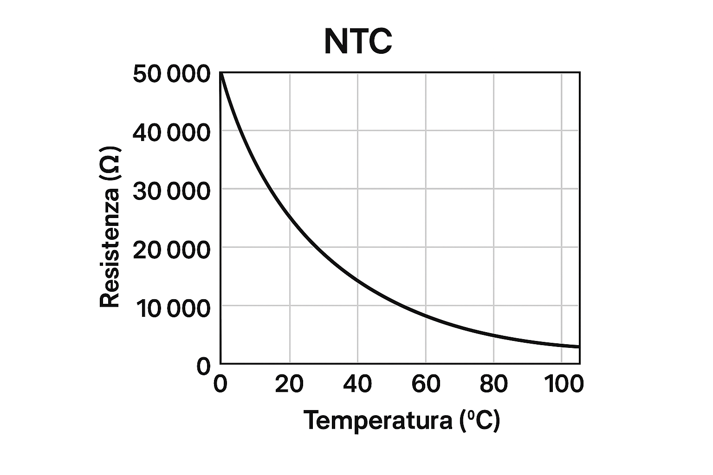
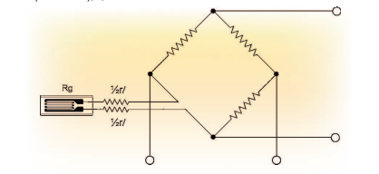
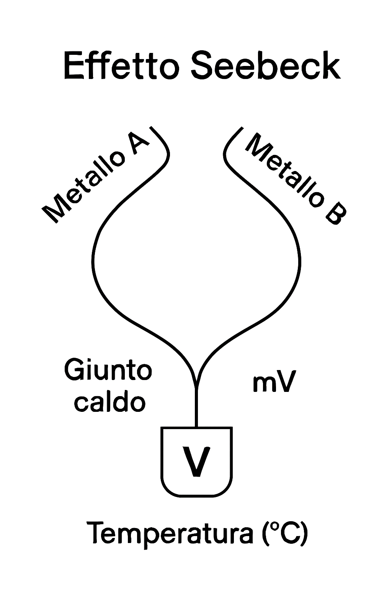

# 4. Sensori di Temperatura

## Termistori (NTC)
Sensori resistivi che variano con la temperatura.

## Condizionamento (Ponte di Wheatstone)
Per leggere le variazioni di resistenza (come in NTC o PT100) si usa questo circuito:

## Sensori Integrati (LM35)
Sensore che fornisce 10mV per grado Celsius.

## Termocoppie
Schema di collegamento standard:

[Torna all'Indice](./index.md)
