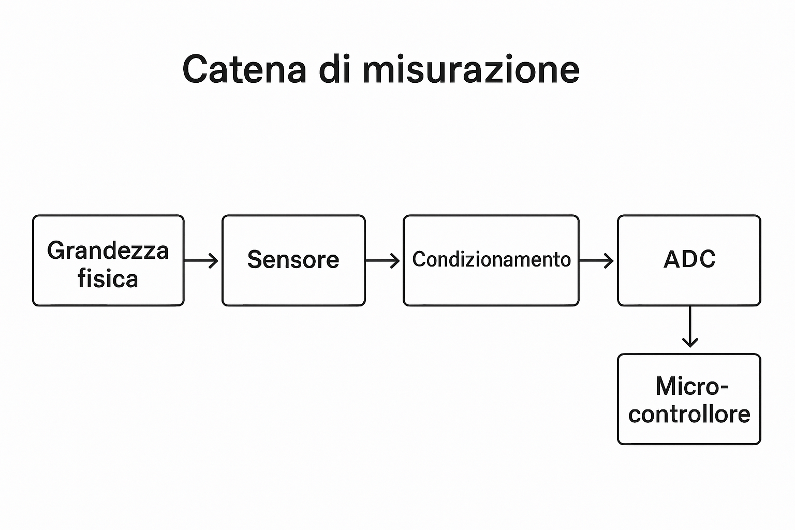

# U.D. 2.1 - Classificazione dei Sensori

## Obiettivi
In questa unità imparerai la terminologia fondamentale e come si inserisce un sensore all'interno di un sistema elettronico.

---

## 1. La Catena di Misura
Ogni sistema di acquisizione dati segue uno schema logico preciso. Il sensore è solo il primo passo.

*Figura 1: Flusso del segnale dalla realtà fisica al microcontrollore.*

### Analisi dei blocchi
1.  **Grandezza Fisica:** Il fenomeno reale (temperatura, velocità, luce).
2.  **Sensore/Trasduttore:** Il dispositivo che converte la grandezza fisica in una grandezza elettrica.
3.  **Condizionamento:** Il blocco che amplifica, filtra e pulisce il segnale per renderlo leggibile.
4.  **ADC (Analog to Digital Converter):** Converte il segnale analogico (volt) in numero binario.
5.  **Microcontrollore:** Il "cervello" (es. Arduino) che elabora i dati.

---

## 2. Classificazione: Attivi vs Passivi

| Tipo | Descrizione | Esempio | Alimentazione Esterna? |
| :--- | :--- | :--- | :--- |
| **Attivi** (Generatori) | Generano direttamente tensione convertendo l'energia fisica. | Termocoppia, Fotovoltaico | **No** |
| **Passivi** (Modulatori) | Variano la resistenza (R, L, C). | Fotoresistenza, Termistore | **Sì** |
