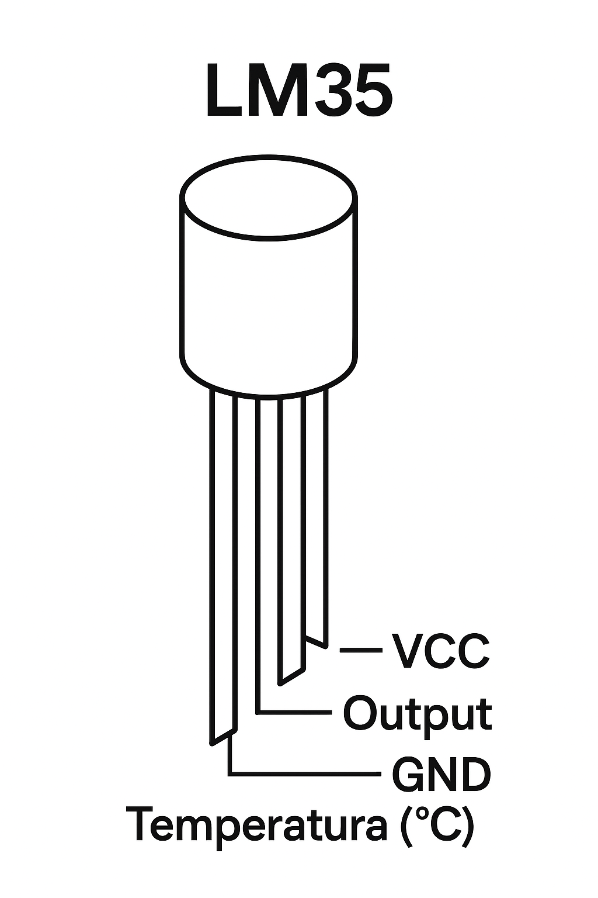

# U.D. 2.4 - Sensori di Temperatura

## Obiettivi (TPSEE)
In questa unità impareremo a **selezionare il sensore termico corretto** analizzando le specifiche tecniche di tre tecnologie principali: Resistiva, a Semiconduttore e Termoelettrica.

---

## 1. I Termistori (NTC) - Economici ma Non Lineari
Gli NTC (*Negative Temperature Coefficient*) sono resistori che diminuiscono la loro resistenza quando si scaldano.

### Analisi della Caratteristica
Guardando il grafico, notiamo che la variazione non è una linea retta, ma una curva esponenziale.


*Figura 1: La risposta di un NTC. Nota come la sensibilità sia alta a freddo e bassa a caldo.*

Questo comporta una difficoltà progettuale:
* **Vantaggio:** Costano pochissimo (pochi centesimi).
* **Svantaggio:** Serve una formula complessa (Steinhart-Hart) o una tabella (Look-up table) nel microcontrollore per leggere la temperatura corretta.

---

## 2. Sensori Integrati (LM35) - Precisione Lineare
L'LM35 è un circuito integrato progettato per semplificare la vita al progettista.


*Figura 2: L'LM35 ha 3 pin e fornisce un'uscita già calibrata.*

### Perché sceglierlo (Datasheet)
* **Linearità:** L'uscita è di **10 mV per ogni grado Celsius**.
* **Calcolo:** Semplice legge matematica: $T(°C) = V_{out} / 0.01$.
* **Esempio:** Se leggo 0.25V col multimetro, sono esattamente 25°C.

---

## 3. Le Termocoppie - Per Ambienti Estremi
Sia gli NTC che gli LM35 fondono sopra i 150°C. Per misurare i fumi di un camino o un forno (400°C - 1000°C) si usano le Termocoppie.

### Effetto Seebeck
Il principio è fisico, non elettronico: unendo due metalli diversi (es. Chromel e Alumel) si genera una piccolissima tensione proporzionale al calore.


*Figura 3: La giunzione calda genera una differenza di potenziale (mV).*

> **Nota Tecnica:** Il segnale è debolissimo (microvolt). È obbligatorio usare un amplificatore operazionale di precisione per leggerlo con Arduino.

---

## 4. Esercitazione Pratica
**Obiettivo:** Realizzare un termometro digitale con LM35 e Arduino.

**Codice Sorgente:**
```cpp
const int sensorPin = A0; // Pin dove colleghi l'uscita dell'LM35

void setup() {
  Serial.begin(9600);
}

void loop() {
  int reading = analogRead(sensorPin);  
  float voltage = reading * (5.0 / 1023.0);
  float temperatureC = voltage * 100; 
  
  Serial.print("Temperatura: ");
  Serial.print(temperatureC);
  Serial.println(" C");
  delay(1000);
}
